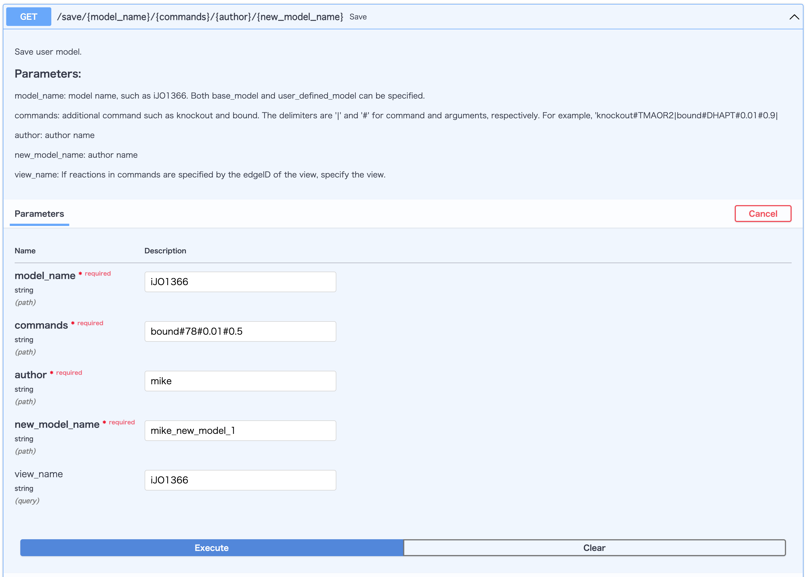

# Kosmogora
The goal of Kosmogora is to provide a server that centralizes management and collection of biological data spread across multiple databases. Centralization is relevant as biological databases have grown in numbers and sizes. They now each require specific knowledge to efficiently manipulate and dig information out of them. Instead, Kosmogora will provide a simpler http API for the users and will gather and convert data internally before returning the result to the user in JSON format. This is used in [ECellDive](https://github.com/ecell/ECell_Dive).

## Create Environments
We strongly recomend to make a separated [python environment](https://docs.python.org/3/library/venv.html).

For example, provided python is intalled, on LINUX or MacOs:
```
$ python -m venv /path/to/new/virtual/environment
$ source /path/to/new/virtual/environment/bin/activate
```

On Windows
```
$ /path/to/python -m venv /path/to/new/virtual/environment
$ /path/to/new/virtual/environment/bin/activate.bat
```

## Install dependencies

### Automaticaly

This process can be done by `preparation.sh` script (for LINUX and MacOS only).

### By hand

First, install dependent libraries.

```
$ pip install -r requirements.txt
```

Download database files and place them in `./models`.
Call those commands from the root of this repository
```
wget http://bigg.ucsd.edu/static/namespace/bigg_models_reactions.txt -OutFile ./models/bigg_models_reactions.txt
wget http://bigg.ucsd.edu/static/namespace/bigg_models_metabolites.txt -OutFile ./models/bigg_models_metabolites.txt
wget https://www.metanetx.org/cgi-bin/mnxget/mnxref/reac_prop.tsv -OutFile ./models/reac_prop.txt
wget https://github.com/ecell/id2id/releases/download/test2/id2id.tsv -OutFile ./models/id2id.txt
```

*Note: Currently, we are indeed downloading the content of the database and store them locally. This is to avoid the hassle of handling the query API of each databases and to focus on handling the requests between other systems and Kosmogora (as it is the case with [ECellDive](https://github.com/ecell/ECell_Dive))*

Run Initialization before launch server

```
$ python obj_manager.py -c
```

## Run the server

```
$ uvicorn --host [your ip address] --port 8000 app:app
```

Open your browser at `http://[your ip address]:8000/docs`.



See more about FastAPI here: https://fastapi.tiangolo.com/